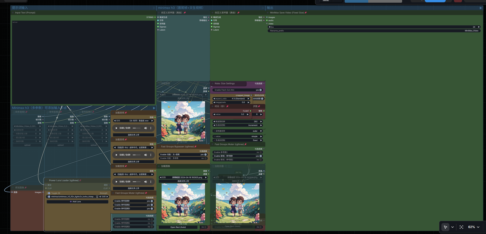
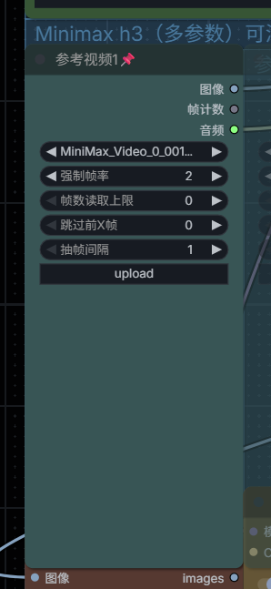
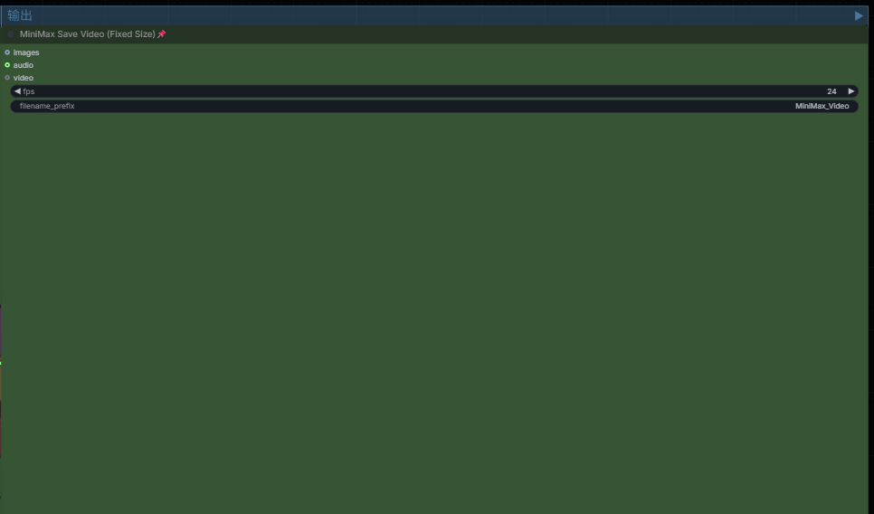

Currently, most video loading and saving nodes in ComfyUI dynamically resize themselves based on the loaded or generated video dimensions, which often breaks the carefully arranged workflow layout and visual consistency.[cite: 8]

To solve this issue, this node package was developed with the assistance of Gemini.[cite: 8]

### 1. MiniMax Load Video (Fixed Size)
* **Zero UI Distortion**: Prevents the node from auto-expanding when loading videos, keeping your visual canvas clean and compact.[cite: 8]
* **Audio & Video Dual Output**: Outputs both video frame tensors and independent AUDIO stream tensors, perfectly designed for models like MiniMax-H3 that require video and audio references.[cite: 8]
* **24FPS Unified Resampling**: Resamples video input to 24FPS by default to avoid lip-sync issues and temporal motion artifacting.[cite: 8]
* **One-Click Preview Eraser**: Context menu right-click option (`🧹 Clear Video Preview`) that completely purges video caches while strictly maintaining the current node width and height.[cite: 8]

### 2. MiniMax Save Video (Fixed Size)
* **Fixed Render Dimensions**: Retains its exact size before and after video encoding, ensuring no unwanted UI layout shifting.[cite: 8]
* **Multi-Format Input Flexibility**: Supports direct inputs for IMAGE, VIDEO objects, and standalone AUDIO tracks.[cite: 8]
* **Automated Audio Merging**: Automatically merges external audio lines into high-compatibility H.264 MP4 videos using FFmpeg.[cite: 8]

### 3. MiniMax Aspect Ratio Matcher
* **Auto Aspect Ratio Detection**: Automatically analyzes input image dimensions and selects the closest standard aspect ratio (e.g., 16:9, 9:16, 1:1)[cite: 3].
* **32-Grid Alignment**: Default `multiple=32` alignment ensures exported dimensions satisfy VAE requirements and prevent tensor layout distortion[cite: 3].
* **Megapixel Scaling**: Dynamic resolution computation driven by customizable `megapixels` settings[cite: 3].
* **High-Res Center Crop**: Outputs `cropped_image` via Center Crop without downscaling, preserving edge sharpness while matching target ratios[cite: 3].

  

  

  

  

---

针对 ComfyUI 原生及第三方视频节点“界面随预览动态变形”的痛点，在 Gemini 的辅助下开发了这套极简风格的自定义节点包。[cite: 8]

### 🌟 核心特性 (Key Features)

#### 1. MiniMax Load Video (Fixed Size) | 固定尺寸视频加载节点
* **界面零变形**：彻底解决加载视频后节点被自动拉伸、破坏工作流美观与布局的问题。[cite: 8]
* **音视频双输出**：支持同时输出视频帧序列与独立 AUDIO 音频张量，完美适配 MiniMax-H3 等模型对视频/音频参考的需求。[cite: 8]
* **24FPS 统一重采样**：默认重采样为 24FPS，有效解决音画不同步及动态失真问题。[cite: 8]
* **一键清除预览**：支持右键菜单“🧹 清除视频预览”，且清除后完全锁定并保留当前节点的长宽尺寸，维持界面整洁。[cite: 8]

#### 2. MiniMax Save Video (Fixed Size) | 固定尺寸视频保存节点
* **尺寸锁定**：视频生成与保存后，节点依然保持设定好的紧凑尺寸，不撑乱画布。[cite: 8]
* **多接口灵活输入**：同时支持输入 IMAGE（图像）、VIDEO（视频对象）以及独立的 AUDIO（音频）。[cite: 8]
* **音视频自动合成**：若连接了音频线，将自动通过 FFmpeg 压制合成带音轨的 H.264 MP4 视频。[cite: 8]

#### 3. MiniMax Aspect Ratio Matcher | 宽高比自动适配节点
* **自动比例检测**：开启 `auto_detect_image` 后，自动匹配最贴近的标准宽高比（如 16:9, 9:16, 1:1 等）[cite: 3]。
* **32倍整除对齐**：默认 `multiple=32`，确保输出尺寸严格符合底层 VAE 的整除要求，避免图像拉伸或报错[cite: 3]。
* **百万像素控帧**：支持通过 `megapixels` 动态计算目标生成分辨率[cite: 3]。
* **无损中心裁剪**：输出 `cropped_image` 进行保持画质的 Center Crop，完美对齐目标比例[cite: 3]。